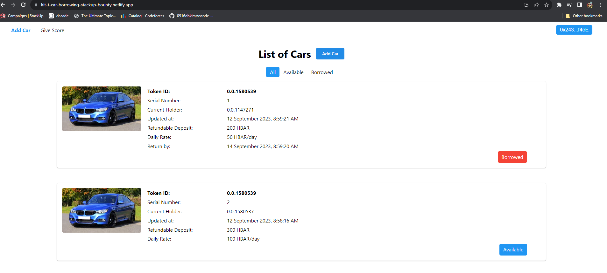
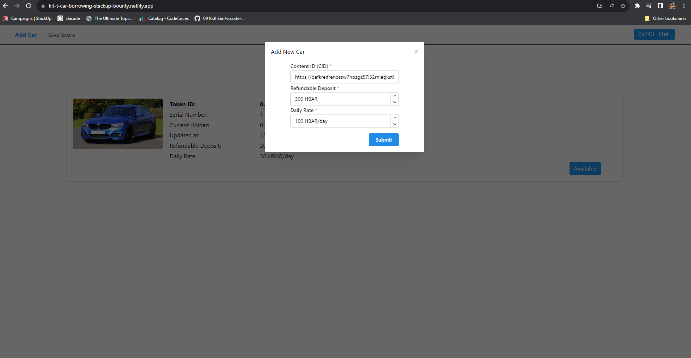
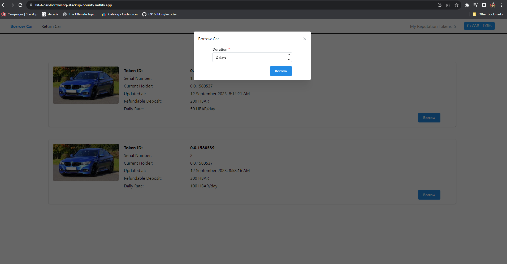
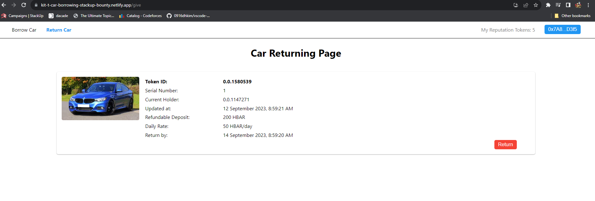

<br />
<div align="center">
  <a href="https://github.com/teyweikiet/stackup-car-borrowing-bounty">
    
  </a>

  <h1 align="center" style="border-bottom: 0;">kit-t's Car Hire</h1>

  <p align="center">
    A full stack Car borrowing Dapp!
    <br />
    <a href="https://kit-t-car-borrowing-stackup-bounty.netlify.app"><strong>View Demo</strong></a>
    |
    <a href="https://hashscan.io/testnet/contract/0.0.1580537"><strong>View Contract</strong></a>
    <br />
  </p>
</div>

<details>
  <summary>Table of Contents</summary>
  <ol>
    <li>
      <a href="#about-the-project">About The Project</a>
      <ul>
        <li><a href="#functionalities">Functionalities</a></li>
        <li><a href="#thought-process">Thought Process</a></li>
      </ul>
    </li>
    <li>
      <a href="#built-with">Built With</a>
      <ul>
        <li><a href="#backend">Backend</a></li>
        <li><a href="#frontend">Frontend</a></li>
      </ul>
    </li>
    <li>
      <a href="#getting-started">Getting Started</a>
      <ul>
        <li><a href="#prerequisites">Prerequisites</a></li>
        <li><a href="#installation">Installation</a></li>
      </ul>
    </li>
	<li>
      <a href="#getting-started">Contacts</a>
    </li>
  </ol>
</details>

## About the project

This is a submission for [StackUp's Hedera Capstone Project Expansion Bounty](https://app.stackup.dev/bounty/hedera-capstone-project-expansion).

### Functionalities

- Merchant can add cars for hire
- Customer can borrow cars
- Customer can return cars
- Merchant can give scores to car borrowers

#### Added Features

- Merchant can see a list of cars added and filter them by status (Borrowed or Available). This is important for merchant to keep track of all the inventories and their availabilty.



- Merchant can set custom refundable deposit and daily rate for each car added. This allows merchant to set appropriate rates for different model of cars and cater to customers with different budgets and needs.



- Customer can choose how long to borrow a car for.



- Customer can see when to return the car by. This is essential so that they can return the car on time.



### Thought process

I started tackling the bounty by braimstorming a list of possible features to add, then wrote down pseudo codes to implement them and estimated efforts needed. Afterwards, I prioritized features that can be implemented indepedently with smallest effort and add them incrementally to deliver the most value.

## Built With

### Backend

- Hedera Smart Contract Service to power logic e.g. token creation, minting & transger

- [Remix IDE](https://remix.ethereum.org/) for deployment of Solidity smart contract

- Hedera testnet as EVM testnet for the smart contract

### Frontend

- React as framework for frontend web app development

- Ethersjs for connecting to user wallet & interacting with the testnet

- Netlify for hosting frontend app

- Hashgraph SDK for interacting with Hedera hashgraph

- Mantine for building beautiful, responsive & accessible components

## Getting Started

### Prerequisites

- Install Node.js 18
- [Hedera account](https://portal.hedera.com/)

### Installation

1. Clone the repo
```sh
git clone https://github.com/teyweikiet/stackup-car-borrowing-bounty.git
```

#### Deploying Smart Contract & Creating Topics

1. Checkout latest version of contract deployed [here](./quest-8-backend/contracts/MerchantBackend.sol).

2. Refer instructions on [Hedera campaign quest 8](https://app.stackup.dev/quest_page/advanced-quest-8---car-borrowing-dapp-capstone-project-backend-1) to deploy smart contract from Remix IDE


#### Frontend

1. Go to frontend directory
```sh
cd frontend
```

2. Install NPM packages
```sh
npm install
```

3. Create .env and modify accordingly
```sh
cp .env.example .env
```

## Contacts

* Discord: @_kit_t
* X (Formerly Twitter): [@teyweikiet](https://twitter.com/teyweikiet)
